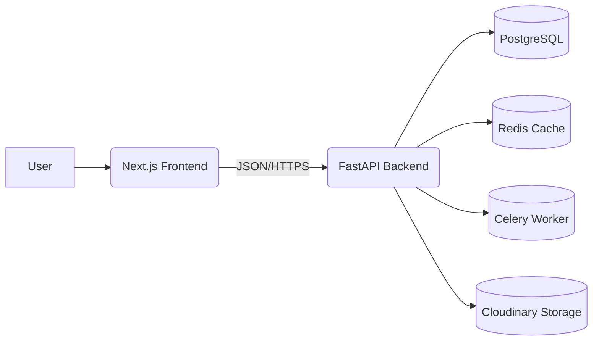

# Byume — Implementation Guide & Master Blueprint

## Executive Summary  
Comprehensive blueprint for Byume’s implementation. Aligns a Next.js (React/Tailwind) frontend with a FastAPI (Python/SQL) backend. Defines system architecture, code and design standards, CI/CD workflows, and AI-assisted development (Stitch, Antigravity, Codex).

## Table of Contents  
1. [Engineering Foundation](#engineering-foundation)  
2. [Repository Architecture](#repository-architecture)  
3. [Frontend Standards](#frontend-standards)  
4. [Backend Standards](#backend-standards)  
5. [Shared Standards](#shared-standards)  
6. [AI Collaboration](#ai-collaboration)  
7. [Dev Lifecycle](#dev-lifecycle)  

---

## Engineering Foundation  
- **Vision:** Embrace an artisanal, personalized experience. Warm, conversational UI, mobile-first, accessible (WCAG AA), secure (HTTPS, input sanitization). Use reusable UI components; communicate only via secure APIs.  
- **Tech Stack:** Frontend on Next.js 15 (React, TypeScript, Tailwind CSS); backend on FastAPI (Python 3.11+, Pydantic, SQLAlchemy). PostgreSQL as the database, Redis for cache, Celery for background tasks. Cloudinary for image storage, Razorpay for payments.  
- **Goals:** Complete custom-order workflow (browse → custom order → quote → pay). Provide admin dashboard (order/inventory management, analytics). Achieve high performance (Lighthouse ≥90), full test coverage, and robust security.


*Diagram:* User interacts with the Next.js app. The app calls FastAPI endpoints. The backend uses PostgreSQL for data, Redis for caching/queues, Cloudinary for media, and Celery (with Redis broker) for async tasks.

---

## Repository Architecture  
- **Monorepo Layout:** Use a monorepo (e.g. with Turborepo) for all code:

```
monorepo/
├── apps/
│   ├── web/      # Next.js customer site
│   └── admin/    # Next.js artist/admin site
├── backend/
│   └── api/      # FastAPI REST API
├── packages/
│   ├── ui/       # Shared React UI components
│   ├── utils/    # Shared utility functions
│   └── config/   # Shared configuration (e.g. theme tokens)
└── .github/      # GitHub Actions workflows
```

- **Backend Structure:** Organize the FastAPI service by feature (routers):

```
backend/api/
├── main.py           # App setup (FastAPI init)
├── routers/          # APIRouter modules (auth.py, orders.py, etc.)
├── services/         # Business logic
├── models/           # SQLAlchemy models
├── schemas/          # Pydantic models (requests/responses)
└── core/             # Configuration, DB session, security utils
```

- **Naming Conventions:**  
  - Folders/files: **kebab-case** (e.g. `user-profile.tsx`).  
  - React components: **PascalCase** (e.g. `ProductCard.tsx`).  
  - Variables: **camelCase** in JS/TS, **snake_case** in Python.  
  - API endpoints: use plural nouns and hyphens (e.g. `/api/orders`, `/api/users/{id}`).

- **Imports & Modules:**  
  - Configure absolute imports (e.g. `import { Button } from 'ui'`).  
  - Use FastAPI’s `APIRouter` to group endpoints; include routers in `main.py`.  
  - Avoid circular imports by placing shared code (DB, settings) in a `core` module.

---

## Frontend Standards  
- **Next.js App Router:** Use the **App Router** (in `app/` directory). Each route folder can have:  
  - `page.tsx` (renders page)  
  - `layout.tsx` (shared layout for nested pages)  
  - `loading.tsx`/`error.tsx` for UI states.  
  - Dynamic routes using `[param]`. (See Next.js docs.)  
- **Component Architecture:** Atomic design. Put shared primitives in `packages/ui` (e.g. `Button.tsx`, `Card.tsx`) and page-specific components in `apps/web/components`. Example:

```
apps/web/
└── components/
    ├── ProductCard.tsx  # uses <Image>, <Button> from ui library
    └── OrderSummary.tsx
packages/ui/
└── Button.tsx
```

- **Design Tokens (Tailwind):** Define theme values in `tailwind.config.js` (colors, spacing, fonts). Example: `{ primary: 'blue-600', secondary: 'emerald-500' }`. Use Tailwind classes like `bg-primary`, `text-secondary`, `p-4`. Maintain a style guide or Storybook illustrating these tokens.

- **State Management:** Use **TanStack Query** for server data. Create custom hooks (e.g. `useGetOrders`) that wrap API calls. Use **Zustand** or Context for client state (shopping cart, UI flags).

- **Forms & Validation:** Use **React Hook Form** together with **Zod** schemas for form inputs. Show inline validation messages. For example: `const schema = z.object({ quantity: z.number().min(1) })`.

- **Responsive Design & Animations:** Design mobile-first. Use Tailwind’s responsive utilities (`sm:`, `md:`). Include smooth animations with Framer Motion (page transitions, element fades), but respect prefers-reduced-motion. Lazy-load images with Next.js `<Image>` for performance.

---

## Backend Standards  
- **FastAPI Structure:** Organize endpoints by routers (e.g. `orders.py`, `products.py`). Include routers in `main.py` with prefixes (e.g. `app.include_router(order_router, prefix="/orders")`).

- **Database Layer:** Use **SQLAlchemy ORM** with PostgreSQL. Keep a single DB session per request. Manage schema changes with Alembic. Example model:

  ```python
  class User(Base):
      __tablename__ = "users"
      id = Column(Integer, primary_key=True, index=True)
      username = Column(String, unique=True, index=True)
      # ...
  ```

- **Authentication:** Implement OAuth2 password flow with JWT tokens. Use FastAPI’s `OAuth2PasswordBearer` and `pyjwt` or similar. Store `SECRET_KEY` and token expiry in environment variables. Secure passwords with bcrypt/Argon2. Example: create `access_token` with expiry and embed user ID.

- **Authorization:** Encode user roles/scopes in JWT. For admin-only routes, add dependencies (e.g. check `current_user.is_admin`). Always verify that users can only access/modify their own resources.

- **File Uploads:** Accept files via FastAPI (`UploadFile`). Upload images to Cloudinary using their SDK or REST API. Save returned URLs/IDs in the database. Serve images through Cloudinary CDN.

- **Notifications:** Use **Celery** for asynchronous tasks. For example, after order creation, enqueue an email/WhatsApp message task. Configure Celery with Redis as broker. Handle retries/backoff.

- **Payments:** Integrate **Razorpay**: generate orders on backend, handle payment verification. Use webhook endpoints (verify signature) to confirm payments, then update order status.

- **Error Handling:** Use HTTPException for known errors. Implement a global exception handler to log unexpected errors and return a generic 500 error. Example:

  ```python
  @app.exception_handler(Exception)
  async def global_exception_handler(request, exc):
      # log error
      return JSONResponse({"detail": "Internal Server Error"}, status_code=500)
  ```

---

## Shared Standards  
- **Code Style:** TypeScript (ESLint, Prettier) and Python (flake8, Black). Enforce strict typing (TS `strict`, Python type hints).  
- **Git Workflow:** Protect `main`. Use `feature/*` branches. Open PRs for merging. Require code review and CI passing before merge.  
- **Commit Messages:** Follow [Conventional Commits](https://www.conventionalcommits.org/). E.g. `feat: add login`, `fix: handle null price`.  
- **Environment Variables:** Store in `.env`. Do not commit secrets. Prefix public ones with `NEXT_PUBLIC_`. Required vars include: `NEXT_PUBLIC_API_URL`, `DATABASE_URL`, `SECRET_KEY`, `RAZORPAY_KEY_ID`.  
- **Security:** Validate *all* inputs (use Pydantic/Zod). Enable CORS only for frontend origins. Periodically run security audits (npm audit, pip-audit).  
- **Accessibility:** Every image needs alt text. Use ARIA roles/labels for complex components. Ensure keyboard navigation and focus styles are present. Verify with Lighthouse/Axe.  
- **Performance:** Aim for ≥90 on Lighthouse metrics. Cache expensive DB queries in Redis. Add database indexes for query-heavy fields. Optimize frontend bundle sizes (code-splitting, lazy loading).

---

## AI Collaboration  
- **Stitch:** Generates Figma designs based on our tokens.  
- **Antigravity:** Generates React/TSX code from finalized designs. *Example prompt:* “You are Antigravity. Create a React component `ProductCard` with props `{product}`. Use Tailwind theme classes and ensure accessibility.”  
- **Codex:** Generates FastAPI/Python code from API specs. *Example prompt:* “You are Codex. Add a FastAPI router for `products`. Use Pydantic schemas from `schemas.py` and SQLAlchemy models.”  
- **Workflow:** 1) Designer finalizes UI with Stitch. 2) Antigravity implements the UI components/pages. 3) Codex implements the corresponding API endpoints/services.  
- **Rule:** Always review AI-generated code. Ensure it follows this guide’s conventions and the approved designs.

---

## Development Lifecycle  
- **Implementation Order:** Setup repository and CI. Build Authentication first. Develop public pages (gallery, product detail). Then inspiration boards and wishlist. Implement order builder and Razorpay payment. Build user and admin dashboards. Finally add notifications and analytics.  
- **Pull Request Checklist:** Lint, type-check, and run tests on each PR (CI runs on every push/PR). No debug logs or hardcoded secrets. Update migration scripts for DB changes.  
- **Code Review:** Confirm UI matches Figma (proper tokens/spacings). Verify API endpoints match FSD paths and schemas. Check security (auth on protected routes), and performance (no large unoptimized loops). Ensure accessibility (labels, contrast).  
- **CI/CD:** Continuous Integration means `main` is always deployable. On push to main, run automated build and deploy to staging. Production deploy is gated (manual approval). Run database migrations before backend deployment. Perform smoke tests and have rollback plan ready.

---  

*Copy the sections above directly into your Canvas page. All code snippets and Mermaid diagrams are ready for pasting.*  

**Sources:** Official Next.js and FastAPI documentation for project structure and routing; Tailwind docs on theme/configuration; CI/CD best-practice guides.